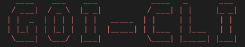

# goi - Command Line Tool



`goi` is a command line tool that can read columns of a table in a database and converts to a sequelize-typescript model file.

This command line tool is suitable for projects that use sequelize ORM and sequelize-typescript decorators for sequelize model definition

## Why?

As I got tired of writing `Sequelize` models for all the hundreds of tables in a database.

## Installation

```
npm install -g @ggsn/goi
```

## Usage

##### To View all options

```
$ goi
```

The command will produce the following output.


##### To generate a Model file from the SQL Table

1. `cd` to the directory where your `.env` or `.env.local` file is present.
   
2. ENV Files is assumed to contain the details of database such as Database Host, Database Port, Database Password and Database name. Refer below example

```txt
DB_HOST=localhost
DB_USER=root
DB_PASS=admin
DB_NAME=testdb
```

3. Now enter the following command.

```sh
$ goi model:new
```

You will be asked to enter the table name with which you have to generate the model. Type the table name (say companies) and hit enter.


The Model file will be generated.

#### Example

If the Schema of `Companies` table is as shown below,


Then the generated model file will be

CompaniesModel.tsx

```
import {
  Sequelize,
  Table,
  AutoIncrement,
  Column,
  PrimaryKey,
  CreatedAt,
  UpdatedAt,
  DeletedAt,
  HasMany,
  HasOne,
  BelongsTo,
  ForeignKey,
  BelongsToMany,
  Model
} from "sequelize-typescript";
import sequelize from ".";

@Table({
  tableName: "companies",
})
export class CompaniesModel extends Model {
  @PrimaryKey
  @Column
  public company_sys_id: number;

  @Column
  public company_id: string;

  @Column
  public company_name: string;

  @Column
  public createdBy: number;

  @Column
  public createdAt: Date;

  @Column
  public updatedAt: Date;

  @Column
  public deletedAt: Date;
}
sequelize.addModels([CompaniesModel]);

```

---

`goi` is developed in order to help automate the repeated tasks. Developers are most welcomed to contribute this project. New Ideas and Suggestions are also welcomed. If you find any bugs or issues, post it in this [link](https://github.com/gogosoon/goi/issues).
